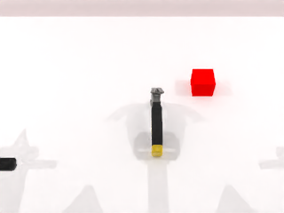

# 🤖 Robotic-Action-Frame-Prediction

**Authors**: [Zzzzyear](https://github.com/Zzzzyear), [Wingedma](https://github.com/Wingedma), [BreezeHe](https://github.com/BreezeHe)

This is an AI model project for robotic arm action frame prediction. Below are detailed instructions for setting up the environment and running the project.

**Project directory structure**: `~/Robotic-Action-Frame-Prediction` (running directory)

```
Robotic-Action-Frame-Prediction/
├── instruct-pix2pix/
│   ├── ...                # Original files and folders of instruct-pix2pix
├── RobotWin_NEW/
│   ├── ...                # Generating data using RoboTwin
├── data/
│   ├── block_hammer_beat/
│   │   ├── 0000.png       # Observation result images
│   │   ├── 0001.png
│   │   └── ...
│   ├── block_handover/
│   │   ├── 0000.png
│   │   ├── 0001.png
│   │   └── ...
│   └── blocks_stack_easy/
│       ├── 0000.png
│       ├── 0001.png
│       └── ...
├── generate_dataset.py           # Script for generating the dataset
├── finetune_instruct_pix2pix.py  # Script for fine-tuning instruct-pix2pix
├── evaluate_predictions.py       # Script for evaluating model predictions
└── predict_with_model.py         # Script for making predictions with the fine-tuned model
```

## 🌟 Project Overview
This project aims to predict future states of robotic arm actions by fine-tuning the pre-trained InstructPix2Pix model. The project includes data preprocessing, model fine-tuning, prediction, and result evaluation.

## 🛠️ Environment Setup

### 1. Create and Activate Conda Environment
All scripts need to be run in the `~/Robotic-Action-Frame-Prediction/` directory. First, create a conda environment named `robotic` and activate it:
```bash
conda create -n robotic python=3.10 -y
conda activate robotic
```

### 2. Install PyTorch (CUDA Version)
Install the CUDA version of PyTorch for better performance:
```bash
pip install torch==2.2.1+cu118 torchvision==0.17.1+cu118 torchaudio==2.2.1+cu118 \
  --extra-index-url https://download.pytorch.org/whl/cu118
```

### 3. Install Other Dependencies
Use `--no-deps` to avoid overwriting PyTorch dependencies:
```bash
pip install -r requirements_finetune.txt --no-deps
```

### 4. Manually Install Additional Dependencies
Manually install `scikit-image` as it is required by `evaluate_predictions.py`:
```bash
pip install scikit-image
```

### 5. Handle Missing Packages
If any packages are still missing during execution, manually install the necessary components.

## 🚀 Running Steps

### 1. Data Preprocessing
All scripts need to be run in the `~/Robotic-Action-Frame-Prediction/` directory. Run the following command to process the data. Each scene will use 80 samples for training and 20 samples for validation:
```bash
python data_prep.py
```
This script processes the raw data into training and validation sets and generates corresponding metadata files. Specifically, it copies images from specified tasks to the appropriate training and validation directories and generates `metadata.jsonl` files for each dataset.

### 2. Model Fine-Tuning
Run the `finetune.sh` script to fine-tune the model. The fine-tuned parameters will be saved in the newly generated `robot_arm_model_scene{i}` directories:
```bash
./finetune.sh
```
This script fine-tunes the model for three scenes (scene 1, scene 2, scene 3) separately and logs the fine-tuning process for each scene. It uses the `accelerate` library for distributed training configuration, leverages the pre-trained `InstructPix2Pix` model, and trains according to specified parameters.

### 3. Model Prediction
Run the `predict.sh` script to make predictions. The prediction results will be saved in the `predictions` directory:
```bash
./predict.sh
```
This script makes predictions for the three scenes separately and logs the prediction process for each scene. It uses the fine-tuned model to predict images in the validation set and saves the prediction results as image files.

### 4. Result Evaluation
Run the following command to evaluate the prediction results using metrics. It will generate evaluation metrics for the three scenes:
```bash
python evaluate_predictions.py
```
This script evaluates the prediction results using SSIM (Structural Similarity Index) and PSNR (Peak Signal-to-Noise Ratio) metrics and outputs the average SSIM and PSNR values for each scene.

## 📊 Result Examples
Below are some examples of the model's predictions compared to the input and target images.

<table>
<tr>
<th>Example</th>
<th>Input</th>
<th>Target</th>
<th>Output</th>
</tr>
<tr>
<td>1</td>
<td></td>
<td></td>
<td></td>
</tr>
<tr>
<td>2</td>
<td></td>
<td></td>
<td></td>
</tr>
<tr>
<td>3</td>
<td></td>
<td></td>
<td></td>
</tr>
</table>

## 📂 Project Files Description
- `data_prep.py`: Data preprocessing script for processing raw data into training and validation sets and generating metadata files.
- `finetune.sh`: Model fine-tuning script for fine-tuning the `InstructPix2Pix` model.
- `finetune_instruct_pix2pix.py`: Specific implementation script for model fine-tuning, including data loading and model training logic.
- `predict.sh`: Model prediction script for making predictions with the fine-tuned model.
- `predict_with_model.py`: Specific implementation script for model prediction, including image loading and model inference logic.
- `evaluate_predictions.py`: Result evaluation script for evaluating prediction results using SSIM and PSNR metrics.
- `requirements_finetune.txt`: List of required dependency packages for the project.
- `environment_finetune.yml`: Conda environment configuration file for the project.

By following the above steps, you can complete the entire process of robotic arm action frame prediction, including data preprocessing, model fine-tuning, prediction, and result evaluation. 🎉
